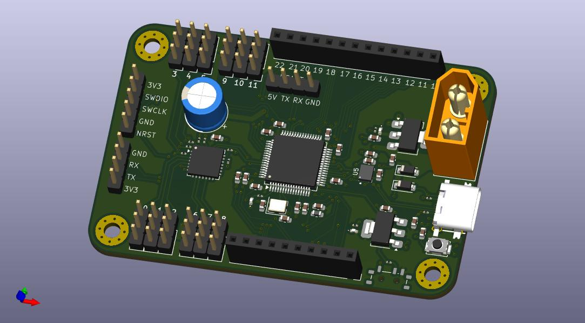
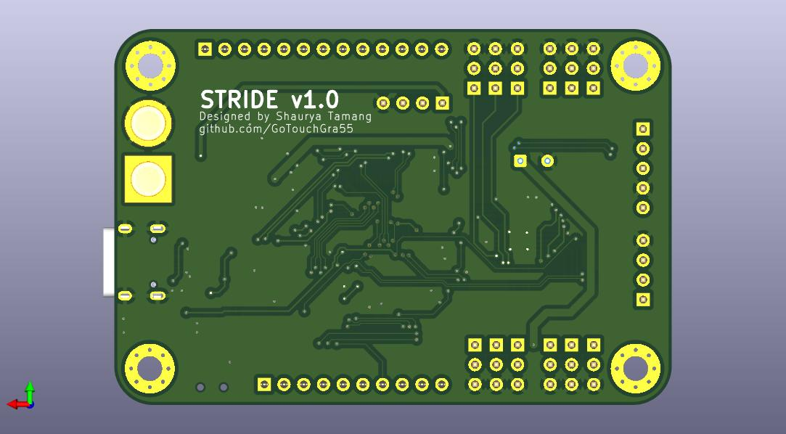
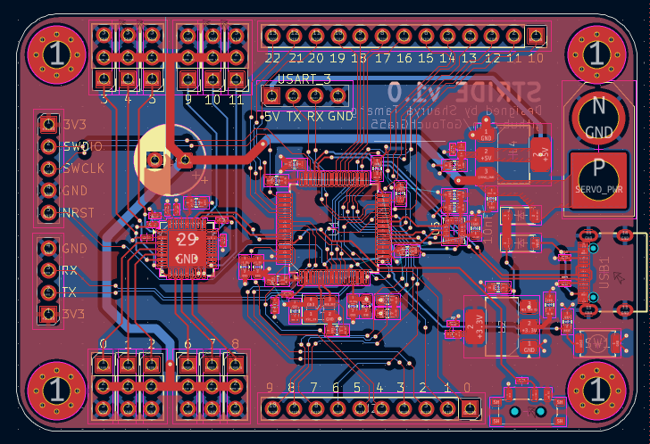
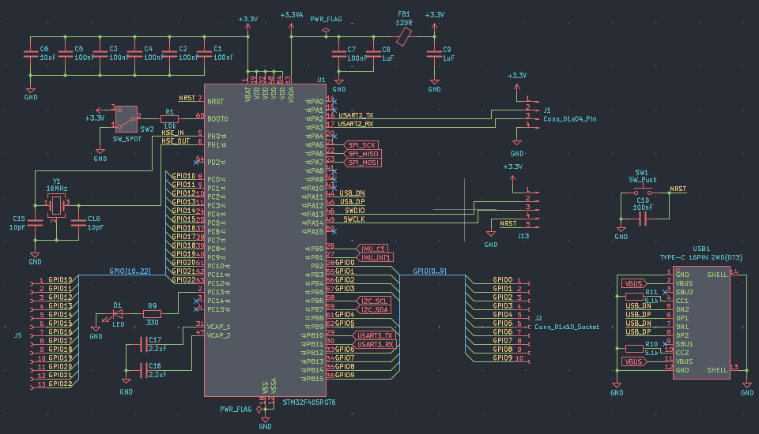
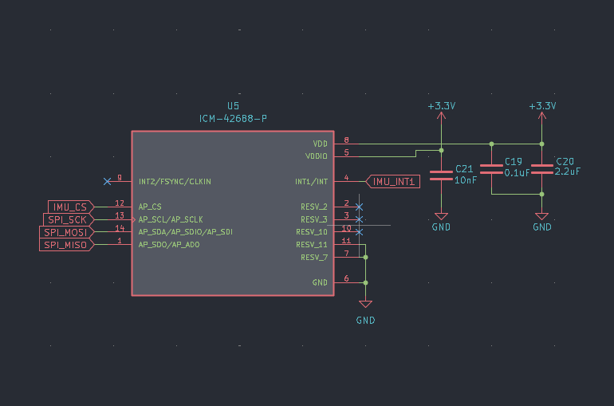
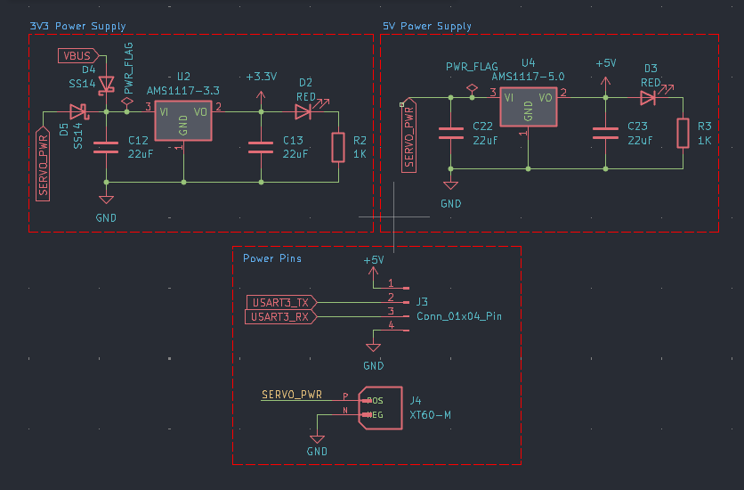
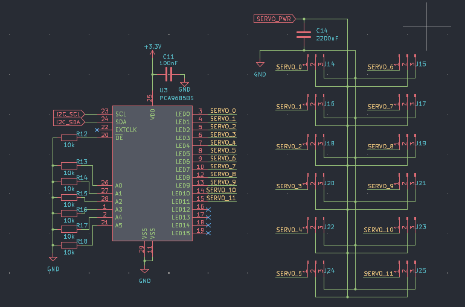
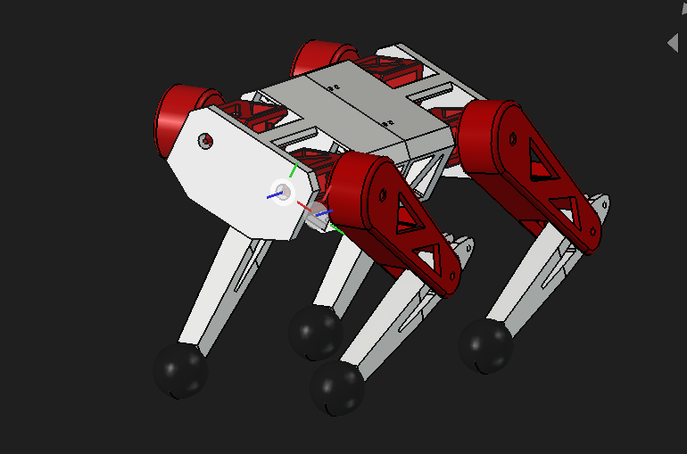

# 🚧 Under Active Development 🚧

# J.O.L.T ⚡

## Overview

JOLT (short for Joint Operated Legged Terrain walker) is my attempt at making a 12-DOF quadruped robot from scratch.

Yes, I designed a custom STM32-based dev board, CAD, and will implement custom firmware! :3

---

### PCB Design (2-layer)

#### Routing

### Schematics

### Mechanical Design

Btw you might be wondering why there are so many triangular cutouts in the design. 
Well first of all, it looks cool and secondly, I read an article about why triangles = **strong**. 
I won't bother explaining the physics here but, you can do your own research on why that is.

---

## System Architecture

### Power System

2s LiPo input (8.4V peak voltage) is regulated to 5V and 3.3V rails for logic and peripherals.

Definitely don't use a higher cell lipo (unless you want to witness the magic smoke :p).

### Control System

An STM32F405RGT6 MCU handles inverse kinematics and motion control while a PCA9685 PWM servo controller chip controls all 12 servos across 4 legs.

### Sensing

An onboard IMU provides orientation and motion feedback.

---

## Hardware

### Actuators

| Joint     | Servo  | Count |
| --------- | ------ | ----- |
| Hip yaw   | MG996R | 4     |
| Hip pitch | MG996R | 4     |
| Knee      | MG996R | 4     |

---

### Development Board

| Component    | Part            |
| ------------ | --------------- |
| MCU          | STM32F405RGT6   |
| IMU          | ICM42688-P      |
| Servo Driver | PCA9685         |
| Power        | 5V + 3.3V LDO   |
| Debug        | ST-Link v2      |
| Input        | XT-60 (2S LiPo) |

## Assembly Guide

### Electronics

Unless you want a _not so pleasant_ experience, I'd advise you to follow the order below:

1. Solder all SMD components first (MCU, IMU, passives)
2. Solder larger components (connectors, headers)
3. Verify power rails (5V, 3.3V) before powering MCU
4. Flash firmware via ST-Link
5. Connect servos and test individual joints

### Body

1. Check parts for any sign of damage. Damaged part = Sad quadruped :(
2. Insert each servo into its respective slot and screw with suitable screws.
3. Make wiring as untangled as possible (because everyone likes cable management, right?)

---

## ⚠️ Warning

1. Double-check polarity of capacitors and power input before powering the board. Otherwise you've made a fancy capacitor bomb :D
2. Use a 2s LiPo battery to ensure safety of components
3. **DO NOT** expose the LiPo battery to high heat or poke the cells.

---

## Firmware

In progress...

---

## Project Status

- [x] CAD
- [x] PCB
- [ ] Assembly
- [ ] Initial tests

---

## License

MIT License - see [LICENSE](LICENSE)

---

## Author

**Shaurya Tamang**  
GitHub: https://github.com/GoTouchGra55  
Website: https://shauryatamang.netlify.app

---
