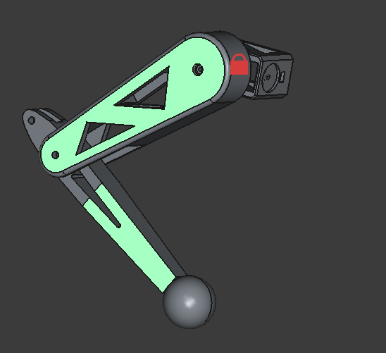
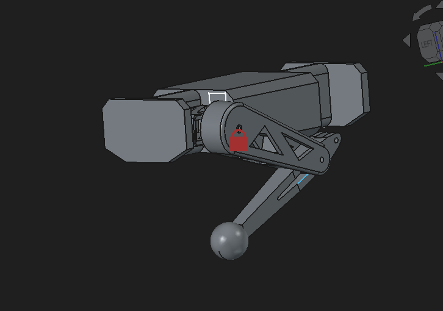
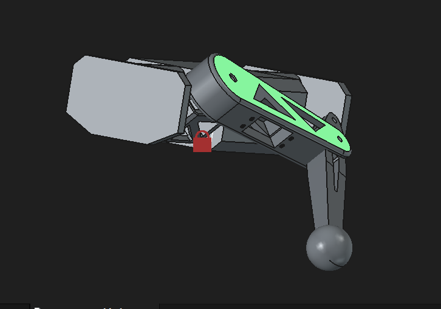

# 🚧 Under Active Development 🚧

# J.O.L.T ⚡

### Joint Operated Legged Terrain-walker

A fully custom quadruped robot featuring in-house electronics, mechanical design, and real-time control firmware.

---

## 📌 Overview

JOLT is a 12-DOF quadruped robot designed and built entirely from scratch - including a custom STM32-based control board, CAD-designed mechanical structure, and firmware implementing inverse kinematics and gait control.

The goal of this project is to explore the full robotics stack:

- Embedded systems
- Mechanical design
- Motion control
- System integration

---

## ✨ Key Features

- 🧠 Custom STM32F405RGT6-based board
- 🤖 12 servo actuators
- 📐 Real-time inverse kinematics
- 🧭 Integrated IMU for motion sensing
- 🔌 Single-board power + control system
- 🛠 Fully self-designed PCB and CAD

---

## 📸 Preview

### 🧩 PCB Design (2-layer)

#### Top

#### Bottom

#### Routing

### 🦾 Mechanical Design

### Leg

### Body with leg

I didn't add the chassis design to the step files folder because, although it would definitely make the build more polished, it ate through my budget of **$300** in **TOTAL**. So, I'll be making the chassis out of local materials for now and print it later when I have money (_or when I get a 3d printer :3_)

---

## 🧠 System Architecture

### Power System

2s LiPo input (8.4V peak voltage) is regulated to 5V and 3.3V rails for logic and peripherals.

### Control System

An STM32F405RGT6 MCU handles inverse kinematics and motion control.

### Actuation

A PCA9685 PWM driver controls 12 servos across 4 legs.

### Sensing

An onboard IMU provides orientation and motion feedback.

---

## 🔧 Hardware

### Actuators

| Joint     | Servo  | Count |
| --------- | ------ | ----- |
| Hip yaw   | MG996R | 4     |
| Hip pitch | MG996R | 4     |
| Knee      | MG996R | 4     |

---

### Custom Control Board

| Component    | Part            |
| ------------ | --------------- |
| MCU          | STM32F405RGT6   |
| IMU          | ICM42688-P      |
| Servo Driver | PCA9685         |
| Power        | 5V + 3.3V LDO   |
| Debug        | ST-Link         |
| Input        | XT-60 (2S LiPo) |

## 🛠 Assembly Guide

### Electronics

1. Solder all SMD components first (MCU, IMU, passives)
2. Solder larger components (connectors, headers)
3. Verify power rails (5V, 3.3V) before powering MCU
4. Flash firmware via ST-Link
5. Connect servos and test individual joints

### Body

1. Check parts for any sign of damage.
2. Insert each servo into its respective slot and screw with suitable screws.
3. Make wiring as untangled as possible (for servos)

---

## ⚠️ Warning

1. Double-check polarity of capacitors and power input before powering the board.
2. Use a 2s LiPo battery to ensure safety of components
3. **DO NOT** expose the LiPo battery to high heat or poke the cells.

---

## 💻 Firmware

### Current Progress

- [x] Inverse kinematics
- [ ] Gait generation
- [ ] Servo control integration
- [ ] Sensor fusion

### Planned Features

- Closed-loop control
- Terrain adaptation
- Self-balancing

---

## 📊 Development Status

- [x] CAD design (legs + chassis)
- [x] PCB schematic + layout
- [ ] Full assembly
- [ ] Walking test

---

## 🚀 Future Improvements

- Custom high-performance actuators
- Onboard sensor fusion
- Wireless control (LoRa / BLE)
- Autonomous navigation

---

## 📜 License

MIT License — see [LICENSE](LICENSE)

---

## 👤 Author

**Shaurya Tamang**  
🔗 GitHub: https://github.com/  
🌐 Website: https://shauryatamang.netlify.app

---
